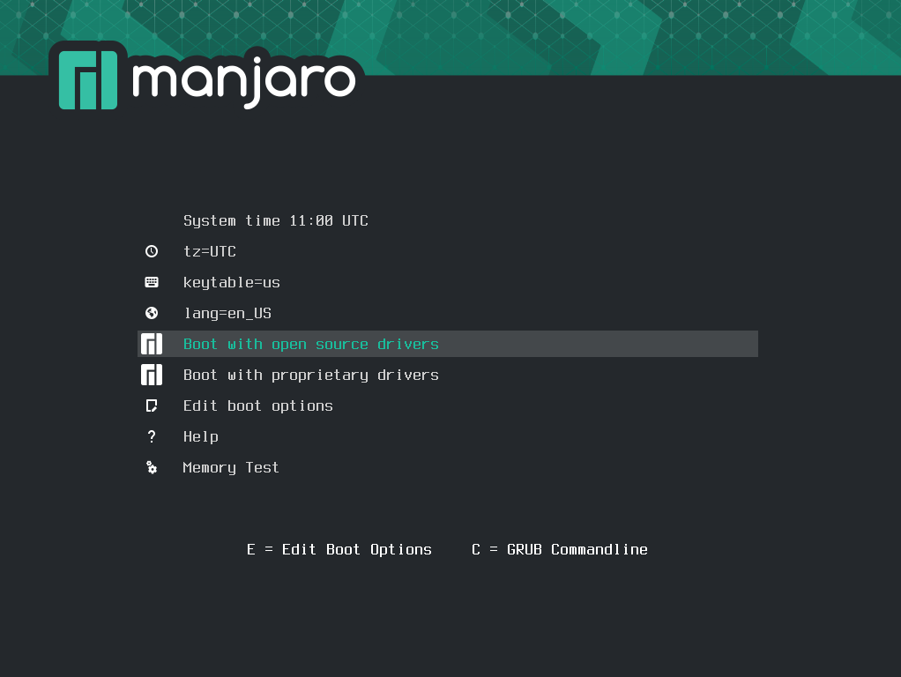
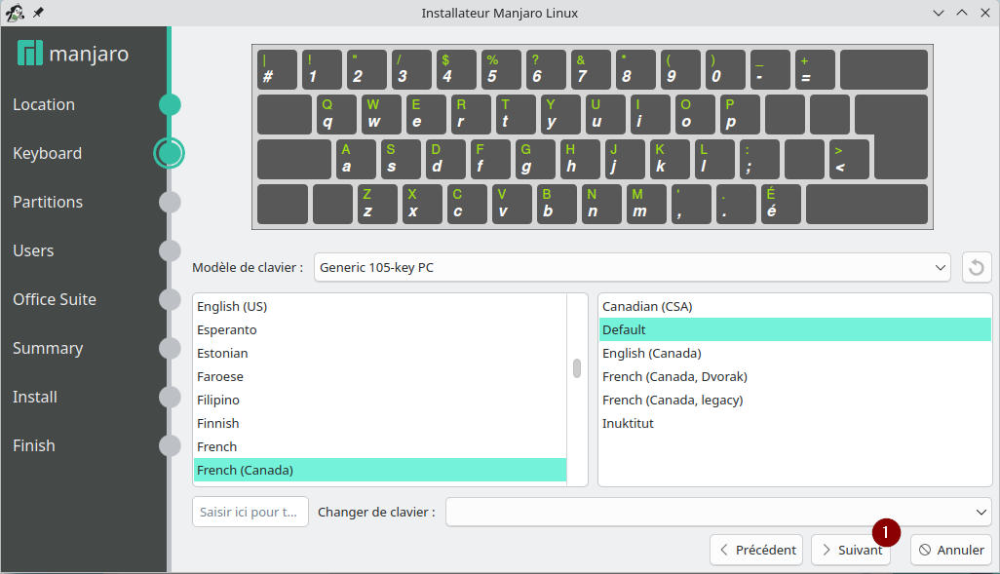
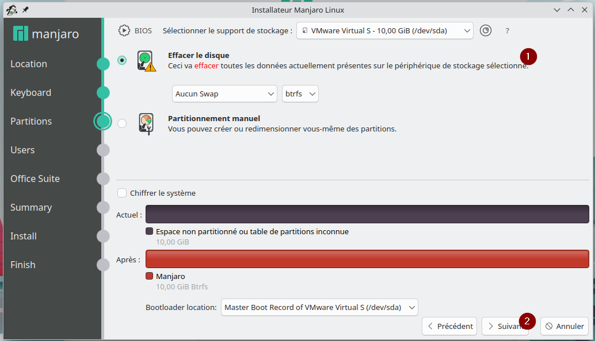
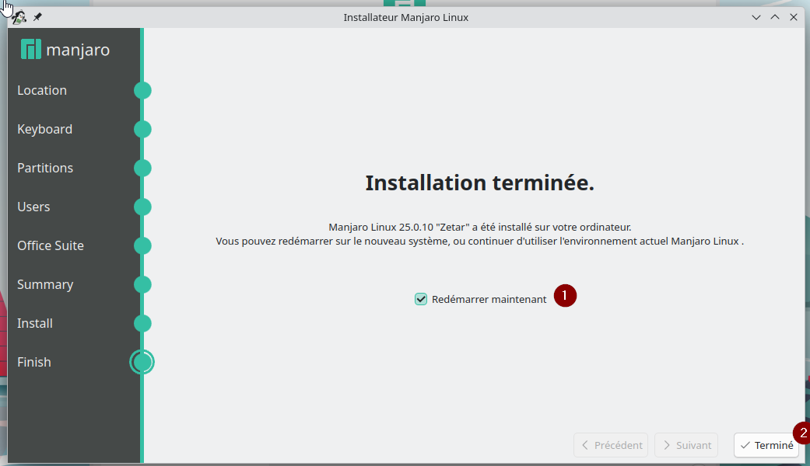

# Basic Homelab

Vous trouverez ici la documentation sur comment réaliser un homelab de base. Le but étant de séparer le réseau de compagnie en deux; un public et un privé. Le segment privé supportera un serveur gitolite et sera uniquement filaire. Le segment public sera accessible par wi-fi. Le tout passeras par un miniPC avec OpnSense qui sera le pare-feu et le routeur du réseau.

## Voici le schéma du réseau expliqué ci-dessus

# Installation des OS pour le client et le serveur
Balena etcher est un outil facile à utiliser pour formater le périphérique qui va contenir l'OS (une carte SD ou une clé USB)  que vous voulez installer. Voici le lien : [Balena etcher](https://etcher.balena.io/)
## Client: Manjaro OS

Lien pour le téléchargement: [Manjaro OS](https://manjaro.org/)

Allez dans votre bios et dites lui de boot à partir de la clé USB qui contient l'OS

Si vous avez bien configuré le BIOS vous allez être dirigé automatiquement à cette fenêtre lors de l'ouverture de votre ordinateur.

Pour démarrer l'installation cliquez sur "Boot with open source driver"

1. Lancer l'installation

1. Choix de la langue
2. Suivant

Normalement le BIOS de votre ordinateur devrait vous donner la bonne région et zone. Sinon simplement les changer pour votre fuseau horaire.
1. suivant

Choisissez votre clavier
1. Suivant

Si votre ordinateur a plusieurs disques choisissez celui sur lequel vous voulez installer l'OS.
1. Effacer le disque pour partir à neuf
2. Suivant

Création d'utilisateur. Faites attention de ne pas oublier ces informations.
1. Suivant

1. J'ai choisi de ne pas installer de suite Office car j'utilise nano et vim. Le choix vous appartient.
2. Suivant

Ce n'est pas Windows alors prenez le temps de lire si tout semble concorder avec vos besoins et ensuite cliquer sur Installer pour démarrer l'installation.

1. Installer Maintenant

L'installation est en cours.

1. Assurez-vous que "Redémarrer maintenant" est coché.
2. Terminé

### LORS DU REDÉMARRAGE IL FAUT ENLEVER LA CLÉ USB QUI CONTIENT L'OS POUR NE PAS ÊTRE DIRIGER ENCORE VERS L'INSTALLATION

## Serveur: Ubuntu Server

Lien pour le téléchargement: [Ubuntu Server](https://ubuntu.com/download/server)

Allez dans votre bios et dites lui de boot à partir de la clé USB qui contient l'OS
Si vous avez bien configuré le BIOS vous allez être dirigé automatiquement à cette fenêtre lors de l'ouverture de votre ordinateur.

